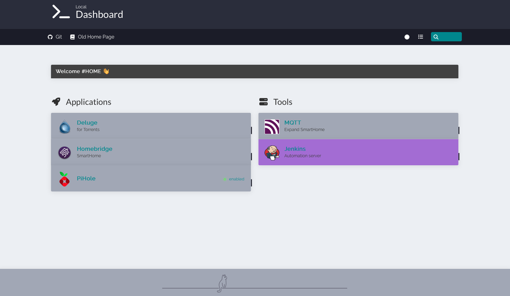

<p align="center"> forked from bastienwirtz/homer --> https://github.com/bastienwirtz/homer
Manny thanks <3 <p>

<h1 align="center">
Homer
</h1>
<h4 align="center">A dead simple static HOMepage for your servER to keep your services on hand, from a simple yaml configuration file.</h4>
preview.png
<p align="center">
 
</p>
## Getting started


### Using docker

```sh
docker run -d \
  -p 8080:8080 \
  -v </your/local/assets/>:/www/assets \
  --restart=always \
  b4bz/homer:latest
```

The container will run using a user uid and gid 1000. Add `--user <your-UID>:<your-GID>` to the docker command to adjust it. Make sure this match the ownership of your assets directory.

**Environment variables:** 

* **`INIT_ASSETS`** (default: `1`)
Install example configuration file & assets (favicons, ...) to help you get started.

* **`SUBFOLDER`** (default: `null`)
If you would like to host Homer in a subfolder, (ex: *http://my-domain/**homer***), set this to the subfolder path (ex `/homer`).

* **`PORT`** (default: `8080`)
If you would like to change internal port of Homer from default `8080` to your port choice.


#### With docker-compose

A [`docker-compose.yml`](docker-compose.yml) file is available as an example. It must be edited to match your needs. You probably want to adjust the port mapping and volume binding (equivalent to `-p` and `-v` arguments).

Then launch the container:

```sh
cd /path/to/docker-compose.yml/
docker-compose up -d
```
